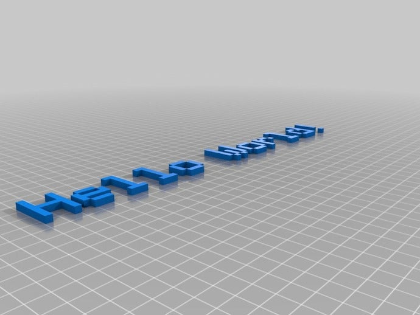

#### OpenSCAD 3D Text Generator

sourced from [Thingiverse](https://www.thingiverse.com/thing:59817)

by [pgreenland](https://www.thingiverse.com/pgreenland) is licensed under the [Creative Commons - Attribution - Share Alike](http://creativecommons.org/licenses/by-sa/3.0/) license.

**Disclaimer:** I am not the creator of this library. All credit goes to Phil Greenland ([pgreenland](https://www.thingiverse.com/pgreenland)). 

---

Basic text renderer implemented as an OpenSCAD module, allowing the generation of text from a string directly in OpenSCAD.

Currently uses a `HD44780 LCD controller dot matrix` font.

Two versions exist, **TextGenerator.scad** covers all OpenSCAD versions before 2015.03. Version 2015.03 deprecated the assign module, allowing for more convenient C like assignments. Therefore I've created a new version removing the deprecated module warning generated by this version.

#### Instructions
1. Import module
1. call drawtext("string")